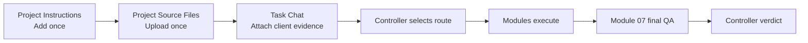
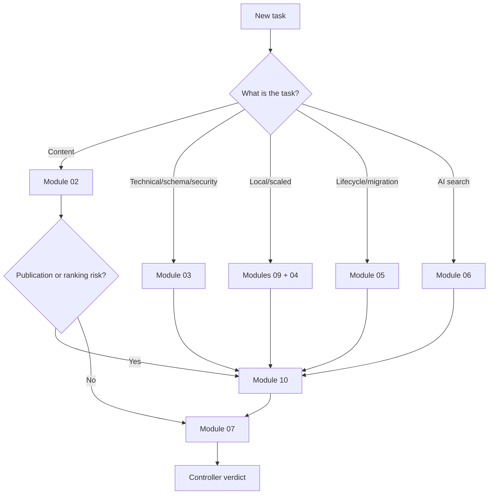
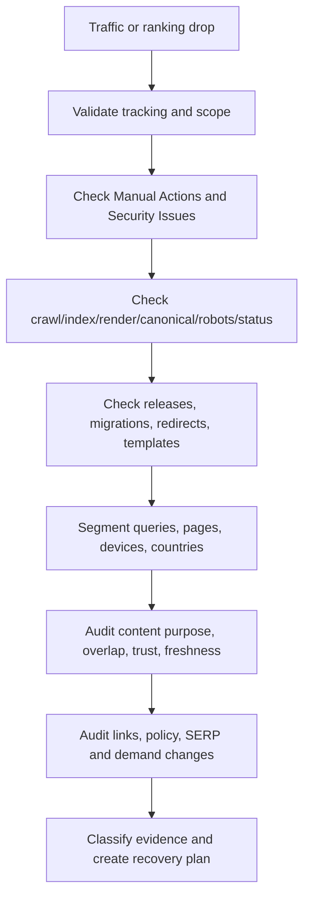

# SEO Master System v7.4.1 - Team Operations Manual

## 1. Purpose
This manual explains how to install and run the Full Flat edition in ChatGPT Projects and how the system automatically routes work through Modules 01-10.

## 2. Three-Layer Operating Model



### Layer 1 - Project Instructions
Paste `PROJECT_INSTRUCTION_FULL_FLAT_v7.4.1.md` once into the Project Instructions field.

### Layer 2 - Project Sources
Upload once:
- controller;
- canonical context;
- Modules 01-10;
- START_HERE.md;
- README.md;
- relevant reference playbooks.

Do not routinely load validation JSON, changelog, migration reports, checksums, or duplicate package variants as execution sources.

### Layer 3 - Task Chat
Attach only the current client evidence: drafts, URLs, exports, briefs, approved claims, brand rules, crawl data, Search Console exports, analytics, backlink data, detector reports, or implementation evidence.

## 3. Automatic Routing Map



## 4. Module 09 Automation
- Mode A: one asset.
- Mode B: automatically for three or more related drafts or any meaningful shared-template batch.
- Mode C: only when external detector results are supplied.
- Detector reports are optional and never determine authorship or approval.

The team does not need to type “Run Mode B” when the batch conditions are obvious.

## 5. Module 10 Automation
Module 10 activates automatically for publication/indexation, scaled/local pages, links, affiliate/review content, third-party hosted sections, structured data, migrations, redirects, expired domains, ranking drops, security issues, manual actions, recovery, or policy-compliance tasks.

It checks:
- Google spam-policy categories;
- people-first content and trust;
- technical eligibility;
- structured-data integrity;
- cross-engine quality and Bing discovery;
- ranking-drop diagnosis;
- prevention and recovery controls.

## 6. Standard Team Requests

### Single Article
```text
Review the attached article for publication. Use the project controller, select the smallest complete route, preserve approved facts, mark missing evidence, run policy and ranking-risk checks, and return the final QA verdict.
```

### Related Batch
```text
Review the attached related page batch for publication. Automatically run the batch similarity route, local/scaled review when applicable, search-policy and ranking-risk governance, and final QA. Compare all pages against one another.
```

### Technical Audit
```text
Audit the supplied crawl, rendered pages, templates, and Search Console evidence. Check crawl/index eligibility, canonicals, robots, redirects, structured data, security, page experience, and applicable search policies. Do not mark untested implementation as verified.
```

### Ranking Drop
```text
Diagnose the ranking and traffic decline using the supplied date ranges and evidence. Separate tracking, demand, technical, migration, content, policy, link, and SERP-composition causes. Do not call it a penalty without direct evidence. Provide a sequenced recovery and retest plan.
```

## 7. Evidence Team Must Supply When Available
- exact URLs and intended indexation state;
- target audience and page purpose;
- approved services, locations, prices, claims, credentials, and legal limitations;
- authors and expert reviewers;
- source citations and first-party proof;
- Search Console manual-action, security, performance, and indexing exports;
- crawl/render/status/canonical/robots/sitemap evidence;
- backlink and sponsored-placement records;
- analytics and release/migration dates;
- structured-data tests;
- detector reports only when the team wants them recorded.

## 8. Publication Gate
Do not publish when:
- a critical policy risk remains;
- a material applicable category is untested;
- fabricated evidence or claims exist;
- a batch lacks distinct page purpose or value;
- technical indexation state is unknown for a high-impact rollout;
- YMYL review is missing;
- structured data does not match visible content;
- owners and retests are undefined.

## 9. Ranking-Drop Triage



## 10. Roles
- Project Owner: confirms business purpose, scope, approvals, and publication decision.
- SEO Lead: owns routing review, search evidence, implementation plan, and monitoring.
- Content Lead: owns factual accuracy, originality, authorship, sources, and revisions.
- Developer: owns technical implementation and test evidence.
- Legal/Medical/Financial Reviewer: owns regulated claims where applicable.
- QA Reviewer: verifies Module 07 and Module 10 gates independently.

## 11. Final Team Checklist
- One package edition and one controller only.
- Project instruction installed once.
- Modules 01-10 uploaded once.
- Current client files attached to the task chat.
- Automatic route stated before execution.
- Evidence states used correctly.
- Module 09 batch comparison run when triggered.
- Module 10 compliance gate run when triggered.
- Technical claims tested, not assumed.
- No ranking or recovery guarantees.
- Module 07 complete.
- Controller verdict supported by evidence.
